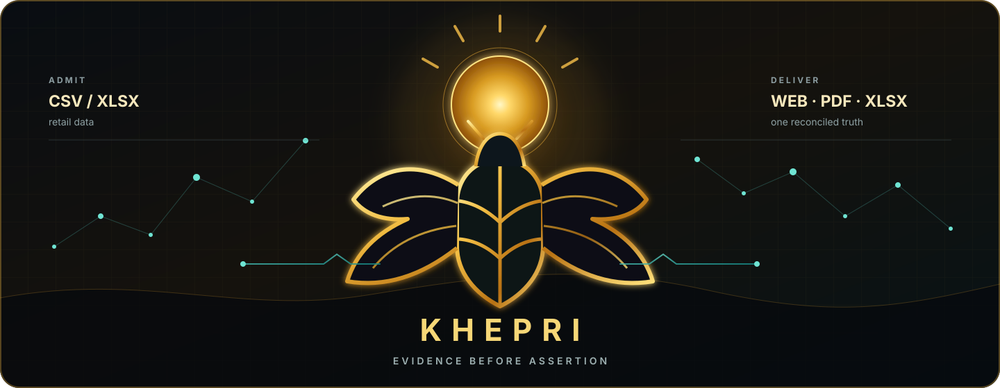

<p align="center">
  
</p>

<h1 align="center">KHEPRI</h1>

<p align="center">
  <strong>Governed retail intelligence, built on evidence.</strong><br />
  Turn retail files into reconciled Arabic and English analysis — without letting presentation
  outrun proof.
</p>

<p align="center">
  <a href="https://github.com/Kemetra/Khepri/actions/workflows/governance.yml"></a>
  
  
  <a href="LICENSE"></a>
</p>

<p align="center">
  <a href="#why-khepri">Why Khepri</a> ·
  <a href="#how-the-truth-travels">Architecture</a> ·
  <a href="#run-it-locally">Run locally</a> ·
  <a href="#governance-with-teeth">Governance</a>
</p>

<p align="center">
  
</p>

---

## Why Khepri

Most reporting systems begin with a chart. Khepri begins one step earlier: **is the data allowed to
support the claim?**

Khepri accepts retail CSV/XLSX data, profiles what is actually present, produces deterministic and
versioned facts, and carries those same facts into web, PDF, and Excel. Unsupported conclusions are
not guessed, smoothed over, or hidden — they are refused visibly and with a reason.

| Admit | Reconcile | Explain | Deliver |
|:---|:---|:---|:---|
| Inspect schema and retail meaning before analysis. | Build one immutable fact package for every surface. | Pair each claim, caveat, and refusal with evidence. | Publish equivalent Arabic and English output to web, PDF, and Excel. |

> **A number becomes a claim only after its evidence survives the journey.**

## How the truth travels

```text
  CSV / XLSX
      │
      ▼
  semantic admission ──► profiling ──► deterministic facts
                                                │
                                      immutable fact package
                                      ┌─────────┼─────────┐
                                      ▼         ▼         ▼
                                     WEB       PDF       XLSX
                                      └─────────┼─────────┘
                                                ▼
                                  one reconciled answer / إجابة واحدة
```

The model is deliberately narrow: facts are calculated once; renderers select and present them but
do not recalculate them. Narratives receive approved aggregates and citations, never raw customer
rows. Operational telemetry stays content-free.

### Product guarantees

- **One source of truth.** Every reported number comes from the same immutable fact package.
- **Admission before assertion.** Unknown schema, scope, identity, or data boundaries fail closed.
- **Refusal is a result.** Unsupported analysis remains visible instead of becoming a plausible guess.
- **Language parity.** Arabic and English carry the same facts, caveats, disclosures, and evidence.
- **Privacy by construction.** Narrative providers see governed aggregates, not source rows.

## Three boundaries, one product

| Family | Owns | Guiding question |
|:---:|---|---|
| **FND** | Repository governance and fail-closed validation | *May this change exist?* |
| **RRA** | Intake, profiling, facts, narrative, reports, and operations | *What does this retail data support?* |
| **RCA** | Identity, organizations, workspaces, and authorization | *Who may act, and within which boundary?* |

The active specification chain covers invite-bound sessions, governed file intake and deletion,
profiling, deterministic facts, grounded bilingual narrative, reconciled report surfaces, reliable
operations, comparisons, evidence, and business-first presentation. The registry — not this summary
— is authoritative.

## Repository atlas

| Path | What lives there |
|---|---|
| [`governance/registry.yaml`](governance/registry.yaml) | Authoritative artifact identities, states, and dependency graph |
| [`governance/decisions/`](governance/decisions/) | Architecture and product-boundary rationale |
| [`governance/families/`](governance/families/) | Ownership boundaries for FND, RRA, and RCA |
| [`governance/specifications/`](governance/specifications/) | Active and retired implementation contracts |
| [`src/khepri_gov/`](src/khepri_gov/) | Minimal governance validator and CLI |
| [`src/khepri/rra/`](src/khepri/rra/) | Retail reporting product slices |
| [`src/khepri/rca/`](src/khepri/rca/) | Commercial identity and organization slices |
| [`src/khepri/runtime/`](src/khepri/runtime/) | Web and worker runtime roles |
| [`src/khepri/infra/`](src/khepri/infra/) | Infrastructure definition |
| [`src/khepri/local/`](src/khepri/local/) | Local-only development wiring |
| [`migrations/`](migrations/) | PostgreSQL schema migrations |
| [`tests/`](tests/) | Governance and product regression tests |

Files under `docs/superpowers/` and `specs/` are historical design and planning records. They can
explain the journey, but they do not govern the destination.

## Run it locally

Khepri requires **Python 3.13**, [uv](https://docs.astral.sh/uv/), Docker, and Docker Compose.

```powershell
uv sync --frozen
docker compose -f docker-compose.local.yml up -d
uv run alembic upgrade head
uv run python -m khepri.local.cli invite
uv run uvicorn khepri.local.app:app --reload
```

Process queued work and retention from separate terminals:

```powershell
uv run python -m khepri.local.cli work
uv run python -m khepri.local.cli sweep
```

The local stack is development wiring, not a deployment or approval record.

## Verify the whole promise

```powershell
uv run khepri-gov validate
uv run ruff check .
uv run pytest
```

Local-stack and browser tests skip when their external prerequisites are unavailable. Deselect them
explicitly with `-m 'not local_stack and not browser'` when needed. CI also runs the benchmark gate,
image checks, and the required server-side CodeScene Code Health Review; the benchmark job certifies
nothing while no benchmark declaration is supplied.

## Governance with teeth

Khepri has one repository owner and one machine-readable source of governance:
[`governance/registry.yaml`](governance/registry.yaml).

- A branch or pull request is a **proposal**.
- The owner merging it to `main` is **approval**; Git records the content, identity, and time.
- Governed artifacts are either **active** or **retired**.
- Product code must be a small, verifiable slice linked to an active specification.
- `khepri-gov validate` rejects malformed metadata, missing documents, broken dependencies, cycles,
  invalid family links, and bad supersession.

There is no parallel authority ledger. The compact governing rules live in the
[`Khepri Constitution`](governance/CONSTITUTION.md).

<details>
<summary><strong>Predecessor boundary</strong></summary>

`Kemetra/Seshat-Platform@f206b7f2c021c7d4e25ba131776ca4b22db6d876` is immutable,
non-authoritative reference material. Khepri imports no predecessor governance, approval,
specification, catalog, ledger, history, or application tree.

</details>

---

<p align="center">
  <sub><strong>KHEPRI</strong> · Evidence before assertion · الدليل قبل الادعاء</sub>
</p>
