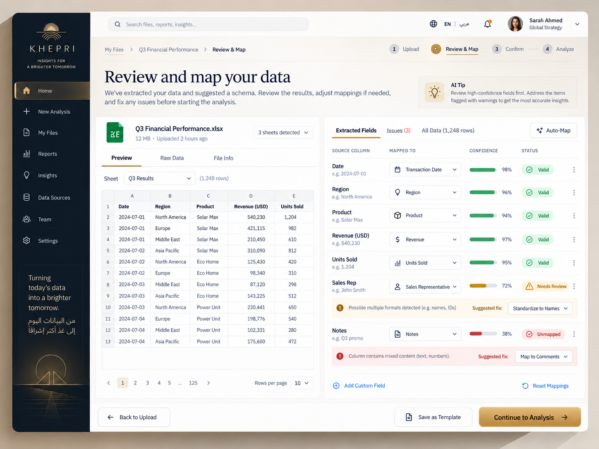
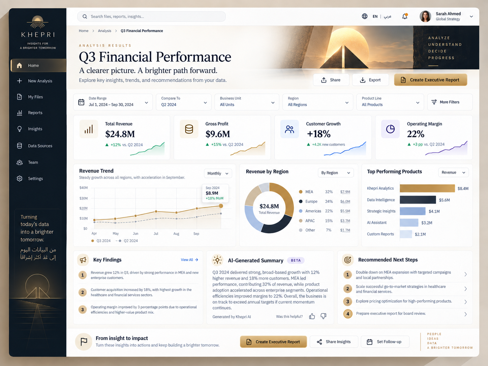
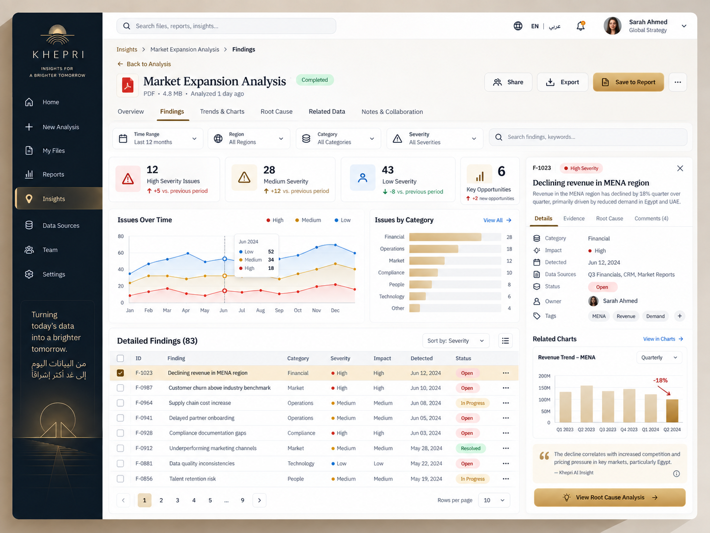
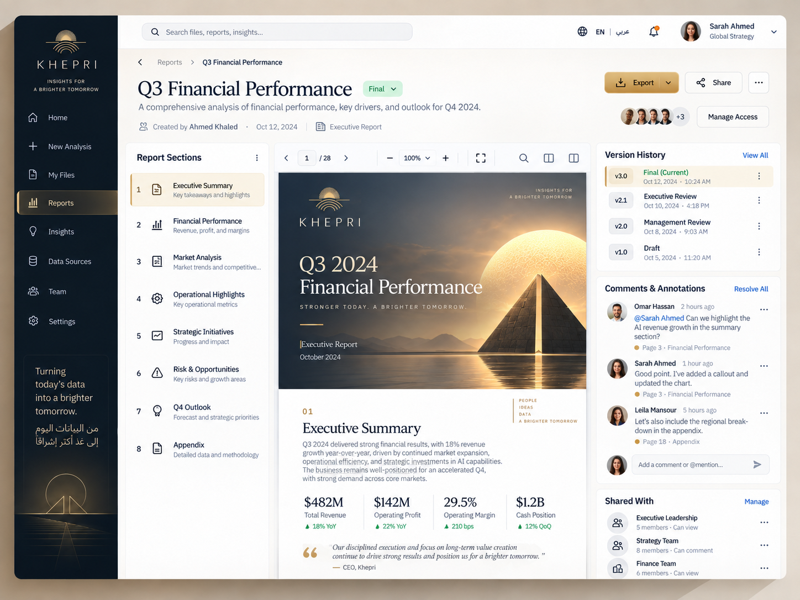
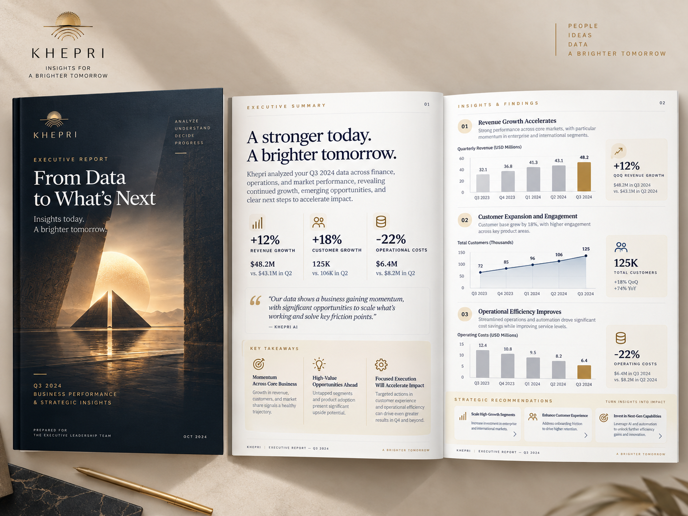

# Khepri Visual Reference Pack

**Status:** proposed for owner acceptance. **Authority:** none of its own.
**Governs:** nothing. **Referenced by:** `KHEPRI_UI_UX_MASTER_SPEC.md` §16.3 and §17.

This directory is the concrete acceptance evidence that the UI/UX Master Specification §16 leaves as
its one deliberate gap (§20: "The one deliberate gap is §16's pack, which is a reviewed-asset
dependency by design"). It exists so that a future implementation agent has no reason to invent a
generic SaaS design.

---

## The rule that governs every image here

> **Visual composition is evidence. Generated product facts are not.**

These images were produced as *visual design references*. They are binding for composition,
hierarchy, typography, density, spacing, and rhythm. They are **not** a source of product truth.

A future implementation agent must take every one of the following from the repository and its
active authority, never from an image in this directory:

| Take from | Never from |
|---|---|
| Actual Khepri routes (§A.2, §F) | A route or breadcrumb drawn in a reference |
| Actual governed copy (copy modules, §14) | Sample sentences rendered in a reference |
| Actual metric semantics (`PRODUCT.md`, governed views) | A figure, percentage, or delta in a reference |
| Actual refusal reasons (§13, governed state) | A "What's missing?" bullet in a reference |
| Actual data | An illustrative table row or chart value |
| Active specifications and `governance/registry.yaml` | A capability implied by a drawn button |

**Never copy a fabricated number, capability, route, source, recommendation, or product feature
simply because it appears in a visual reference.** Where this pack and an active specification
disagree, the specification wins (§A.3).

These images are **not** `docs/ui/design_handoff_khepri/`, which §7.4 names as a non-authoritative
anti-reference and which must not be mined for values. The numeric coincidence — twelve references
there, twelve required in §16.2 — is a coincidence and nothing more.

### Precedence inside this pack

Files 03–11 are the owner's later, coherent visual-family direction. They control the shared visual
tone, material relationships, composition, density, and bilingual presentation when an older
reference differs. Files 01 and 02 remain the more specific references for refusal, period
comparison, the evidence drawer, and true Arabic RTL composition. File 90 remains a mood board only.

A surface-specific, higher-fidelity reference beats a general board. An active specification beats
every image. No precedence rule promotes generated copy, data, routes, controls, or capabilities to
product truth.

---

## Asset policy — binding, and the most likely thing to get wrong

§7 is marked **Binding** precisely "because a coding agent will otherwise invent artwork." Restated
here because these images will tempt exactly that:

- **Egyptian imagery appearing in a reference does NOT authorize recreating it with CSS.** §7.2: a
  coding agent must not recreate supplied artwork using CSS boxes, divs, borders, gradients, or
  programmatic shapes. A visual reference is a reference, not permission to approximate it badly in
  code.
- **Motifs must become reviewed SVG or optimized raster assets committed to the repository before
  any implementation uses them.**
- **If the asset is absent, the surface ships without it.** An absent asset is never replaced by a
  CSS approximation.
- **No div-art. No CSS pyramids. No CSS scarabs. No pseudo-elements used as illustrative artwork.**
- **No emoji icons, and no Unicode glyph pretending to be an icon** (§7.1, §15.22).
- **No random one-off inline SVG drawn by a coding agent** (§7.1).
- **No external image, font, or CDN dependency** — unreachable under the shipped `default-src 'none'`
  CSP and forbidden by the roadmap (§7.4, §16.1).
- **Illustration is forbidden outright in analytical regions** — figures, tables, charts, evidence
  (§7.3). Several panels here place imagery beside analytical content; see the per-file notes.

**No icon family is currently approved** (§7.1). Every panel in this pack is full of icons. They are
**non-binding without exception**. Until an icon family passes the licence-plus-audited-digest
process, surfaces ship **without icons rather than with invented ones**.

Data-driven charts remain code-generated and follow the §8 chart grammar. **`U1-03` is now
authorized** by active `RRA-015`, which discharged §18.2's blocker — so chart work may begin, but it
begins on the strength of **`RRA-015` §Scope and the §8 grammar**, never on the strength of this
pack. No chart in an image here is a source of a figure, an axis value, a kind, or a label.

---

## Provenance

The original three references were supplied by the owner on 2026-09-17 and staged through an
untracked `visual-input/` working directory, which is **not** committed. Nine additional references
were supplied by the owner on 2026-09-20 under the original filenames listed below. Each committed
file is **byte-identical** to its supplied source; no crop, re-encode, or edit was applied.

| Committed as | Original filename | SHA-256 | Dimensions |
|---|---|---|---|
| `01-decision-refusal-rtl-comparison.png` | `ChatGPT Image Sep 17, 2026, 03_49_44 PM (3).png` | `622538d9…6973fe` | 1536×1024 |
| `02-decision-refusal-rtl-evidence-comparison.png` | `ChatGPT Image Sep 17, 2026, 03_49_43 PM (1).png` | `e2648078…caee65` | 1586×992 |
| `03-workspace-overview.png` | `ChatGPT Image Sep 20, 2026, 09_27_50 PM (2).png` | `d509dc45…d256c26` | 1448×1086 |
| `04-welcome-and-journey-entry.png` | `ChatGPT Image Sep 20, 2026, 09_27_49 PM (1).png` | `b8aa1719…35b5215` | 1448×1086 |
| `05-document-upload.png` | `ChatGPT Image Sep 20, 2026, 09_27_50 PM (3).png` | `4e0acc82…5b203a6` | 1448×1086 |
| `06-data-review-and-mapping.png` | `ChatGPT Image Sep 20, 2026, 09_27_51 PM (4).png` | `c3c91809…68b1bf5` | 1448×1086 |
| `07-analysis-processing.png` | `ChatGPT Image Sep 20, 2026, 09_27_51 PM (5).png` | `b7a4bc69…e351da16` | 1448×1086 |
| `08-analysis-results.png` | `ChatGPT Image Sep 20, 2026, 09_27_51 PM (6).png` | `5d1baf30…9bf9f6da` | 1448×1086 |
| `09-detailed-findings-workspace.png` | `ChatGPT Image Sep 20, 2026, 09_27_52 PM (7).png` | `07180cf8…b6d594d0` | 1448×1086 |
| `10-report-workspace.png` | `ChatGPT Image Sep 20, 2026, 09_27_52 PM (8).png` | `6126165d…57f453be` | 1448×1086 |
| `11-executive-report.png` | `ChatGPT Image Sep 20, 2026, 09_27_52 PM (9).png` | `f4c02506…07bf9fcd` | 1448×1086 |
| `90-visual-family-board.png` | `ChatGPT Image Sep 17, 2026, 03_43_58 PM.png` | `0e612e76…34f39d` | 1536×1024 |

The composite boards are committed whole and classified per panel where necessary. The single-screen
and report references are likewise unaltered. Filenames describe actual contents; numbering does not
imply a route sequence.

These are documentation references, not runtime assets. Promotion of any depicted artwork, logo,
font, or icon into shipped UI still requires the repository's reviewed-asset and usage-rights
process.

For files 03–11, every depicted action, control, tab, navigation item, affordance, and interaction
sequence is non-binding. The binding notes describe spatial hierarchy and visual emphasis only. If
an active specification authorizes an equivalent product element, its presentation follows those
relationships; an image never requires the element to exist.

---

## 01 — Decision · Refusal · Arabic RTL · Period Comparison

**Class:** PRIMARY (four panels, each ~760×490)

| Position | Surface | §16.2 requirement |
|---|---|---|
| Top-left | Executive decision — `/app/{lang}/decision` | #7 (partial) |
| Top-right | Refusal / insufficient data | #9 |
| Bottom-left | Arabic RTL workspace overview | #10, and #4 in RTL |
| Bottom-right | Period comparison with evidence panel open | #6, #8 (partial) |

**Binding**

- Overall information density, and the relationship between global frame, context header, KPI row,
  supporting analysis, and evidence — the §E.1 canonical order made visible.
- The §E.4 density floor: the Arabic overview panel carries well past 12 distinct governed figures or
  rows above the fold.
- Visual hierarchy — a single dominant answer, supporting analysis subordinate to it.
- Warm limestone/papyrus content surface against a dark navigation rail as a **compositional**
  relationship (see the non-binding note on the rail's hue).
- Restrained Egyptian geometric identity confined to the rail's foot and page margins, never entering
  an analytical region.
- Editorial typography with strong hierarchy and generous measure.
- Compact enterprise rhythm — three spacing tiers, not seven (§E.3).
- **The refusal panel reads as a governed result, not a crash** (§16.2 #9, §13, §14). It states what
  is missing by name, offers a recovery path, and uses neutral/caution paint rather than error paint.
  This is the strongest single panel in the pack and the reason this file leads it.
- The comparison panel distinguishes baseline from comparand with position, label, and explicit
  figures rather than hue alone (§8.2).

**Non-binding**

- Every figure, percentage, delta, and currency amount (`+28%`, `285.4M`, `8.4M`, `14 months`).
- Fictional organizations and source names (Ministry of Health, CAPMAS, IQVIA, World Bank).
- Generated user names and avatars ("Mostafa K.", "MK").
- All copy not present in the governed copy modules — headings, button labels, takeaway sentences.
- Every icon (§7.1 — no approved family).
- Photographic Cairo/Nile imagery — permitted only as reviewed committed assets (§7.2), forbidden
  in analytical regions (§7.3).
- Chart forms and styling — still non-binding, for a new reason. `U1-03` is authorized by active
  `RRA-015`, so the blocker §18.2 recorded is gone; the chart grammar an implementer follows is §8's
  and `RRA-015`'s, and a chart drawn in an image here fixes no kind, axis, scale, or label.
- The exact navy of the rail. §16.1 states the override does **not** reach "a dark palette (an unmade
  product decision)," and §15.12 forbids colors outside the token set. The rail is binding as
  composition; its hue awaits token work. **This is not authorization for a dark theme.**
- Nav labels drawn in the rail. "Workspace" is an internal contract term and **not a customer noun** —
  the customer-visible scope noun is **Organization** (§14).

**Known generation artifacts and conflicts**

1. **The donut chart in the Arabic overview panel conflicts with §8.1**, which specifies "Share of a
   whole → **Table with percentages, not a pie**," and limits shipped kinds to `CHART_BAR`,
   `CHART_GROUPED_BAR`, `CHART_LINE` with "no kind outside this set." Implement the sector breakdown
   as a table with percentages. Do not inherit the donut.
2. Only **one** trust state is shown on the decision panel. §16.2 #7 requires four, non-color
   differentiated (§11). This panel constrains decision *composition* only.
3. Bordered rows appear inside bounded regions in places; **cards do not nest** (§E.2, §15.2).
4. Minor text-generation artifacts in the Arabic strings; Arabic copy comes from the copy modules,
   never from an image (§9).
5. Arabic-Indic digits, Arabic month names, and U+066A percent are required (§8.4, §9); the rendered
   digits here are not a specimen to copy.

**Relevant specification:** §E.1 · §E.2 · §E.3 · §E.4 · §F.7 · §F.11 · §F.12 · §G · §7 · §8 · §9 ·
§11 · §13 · §14 · §15 · §16.0 · §16.2 (#4, #6, #7, #9, #10) · §16.3 · §17

---

## 02 — Decision · Refusal · Arabic RTL · Evidence Drawer · Period Comparison

**Class:** PRIMARY (five panels; self-labeled presentation sheet with a Khepri footer)

| Position | Surface | §16.2 requirement |
|---|---|---|
| Top-left | Executive decision | #7 (partial) |
| Top-right | Refusal state | #9 (variant) |
| Bottom-left | Arabic RTL welcome / overview | #10, #1 (partial) |
| Bottom-centre | **Evidence drawer** | #8 |
| Bottom-right | Period comparison | #6 |

Committed for one decisive reason: **its Evidence Drawer panel is the pack's only usable rendition of
§16.2 #8, "the product's densest surface."** The drawer shows source rows with type, date, tier, and
confidence, tab-filtered by source class, over a dimmed parent surface.

**Binding**

- The evidence drawer as an **overlay over a dimmed parent**, with a tabbed filter row, one source per
  row, and metadata carried inline — the density ceiling for an overlay surface.
- Evidence adjacency: a claim on the decision panel reaches its source without leaving the analysis.
- Scenario comparison rendered as a labelled horizontal bar set with explicit values (§8.2 — position
  and label, not hue alone).
- The decision panel's KPI row: four governed figures, each with its label and unit visible.
- The §E.1 canonical order and the §16.0 character brief, consistent with 01 — this is the same visual
  family, which is the point of committing both.

**Non-binding**

- Everything listed as non-binding under 01, which applies here without exception.
- The self-applied captions ("1. Executive Decision — Clear recommendations with evidence") and the
  footer strip — presentation chrome, not product UI.
- Source tier and confidence vocabulary ("High", "Medium", "Official", "Derived"). Customer vocabulary
  is *Answered / Answered with caveats / Refused / Not stated*, governed by `RRA-012`, and **nothing
  finer has authority** (§14).
- The green/amber confidence dots — non-color differentiation is required (§11).

**Known generation artifacts and conflicts**

1. **This file's refusal panel leads with red error paint** — a red document mark and red bullet dots.
   §13 requires an analytical refusal to be "**Governed, not error**" severity and "**never error
   paint**"; §15.21 forbids visually de-emphasized refusals. **Use 01's refusal panel, not this one.**
   Retained here only because the other four panels earn their place.
2. A gold medallion tile sits above "Our Recommendation"; §15.3 forbids "a rounded-square icon tile
   above every title." Non-binding.
3. "Better data. Better decisions. A healthier Egypt." is marketing language inside an analytical
   workflow, forbidden by §14.
4. The bottom-left panel's hero imagery is oversized for an analytical surface (§15.13).
5. Visible typo in a caption ("documenttation") — generation artifact.
6. The mobile-frame treatment and the dimmed backdrop are presentation conventions, not specified
   component behavior; §10 governs the drawer at narrow width (full-screen sheet, focus trapped,
   focus restored on close).

**Relevant specification:** §C.6 · §E.1 · §E.2 · §F.6 · §F.11 · §F.12 · §G.2 · §7 · §8 · §9 · §10 ·
§11 · §13 · §14 · §15 · §16.0 · §16.2 (#6, #7, #8, #9, #10) · §16.3 · §17

---

## 03 — Workspace overview

**Class:** PRIMARY — §16.2 #4

**Binding**

- A persistent global frame surrounds a high-density overview without competing with its content.
- The branded hero establishes orientation; operational summaries and recent work carry the usable
  density below it.
- Distinct regions use alignment, spacing, and restrained surface changes rather than ornamental
  card nesting.
- The English surface demonstrates the §E.4 density floor while remaining legible.

**Non-binding**

- Every metric, project, analysis, report, activity event, user identity, status, and relative time.
- Home, New Analysis, My Files, Reports, Insights, Data Sources, Team, and Settings as destinations.
- Quick actions, pinned work, team activity, downloads, connectors, icons, and artwork.

**Known generation artifacts and conflicts**

1. M3 is not an executive dashboard. KPI rows and activity panels do not authorize metrics,
   history, collaboration, or data-source management.
2. Relative times such as “2 hours ago” conflict with the product's absolute-time rule.
3. The sidebar labels conflict with the settled customer navigation set and are composition only.
4. The generated logo, icon family, avatar photography, and hero artwork require separate asset
   admission before runtime use.

**Relevant specification:** §E · §7 · §9 · §14 · §15 · §16.2 #4 · §16.3 · §17

---

## 04 — Welcome and journey entry

**Class:** PRIMARY — §16.2 #1

**Binding**

- One concise promise dominates the entry surface; any authorized primary action, supporting
  explanation, and recent-work context remain subordinate in that order.
- Brand imagery occupies the orientation region without entering the operational content below.
- The journey explanation is short, visually sequential, and clearly separate from live product
  state.
- English and Arabic brand copy carry equal visual importance.

**Non-binding**

- Every recent analysis, file type, capability tile, journey step, action, route, and status.
- Security, trust, collaboration, report-generation, and advanced-AI claims.
- The generated logo, icons, avatar, and scenic artwork.

**Known generation artifacts and conflicts**

1. The four-step flow does not authorize a workflow or fix stage names; active specifications do.
2. Generic document and collaboration capabilities shown here do not describe Khepri's admitted
   product scope.
3. Relative time labels conflict with the absolute-time rule.

**Relevant specification:** §A · §C · §7 · §9 · §14 · §15 · §16.2 #1 · §16.3 · §17

---

## 05 — Document upload

**Class:** PRIMARY — §16.2 #2

**Binding**

- The upload region reads as ready for action, with requirements and data-handling guidance visible
  before submission.
- Authorized analysis context belongs beside or immediately below the input rather than in a later,
  disconnected step.
- Recent-item context and one dominant authorized continuation action remain visually subordinate to
  the input task.
- The page stays calm and legible despite a dense enterprise frame.

**Non-binding**

- Excel, PDF, Word, CSV, multi-file upload, cloud connectors, databases, tags, objectives, and
  recent-upload history.
- File sizes, limits, security certifications, model-training claims, actions, and routes.
- Icons, logo artwork, scenic rail, and generated copy.

**Known generation artifacts and conflicts**

1. Khepri's admitted input types, limits, validation states, and data-use statements come from active
   specifications, not this image.
2. Google Drive, OneDrive, SharePoint, Dropbox, and database connectors have no authority here.
3. SOC 2, ISO 27001, GDPR, encryption, and model-training statements must not ship unless separately
   established.

**Relevant specification:** §C · §F · §7 · §9 · §10 · §11 · §14 · §15 · §16.2 #2 · §16.3 · §17

---

## 06 — Data review and mapping

**Class:** SUPPLEMENTARY / JOURNEY TRANSITION

**Binding**

- A dense two-region composition keeps source context and interpreted structure visible together.
- Review state, warnings, and unresolved items have clear hierarchy without relying on color alone.
- The journey position is visible without displacing the task itself.
- Tables retain readable row rhythm, stable headers, and contained pagination.

**Non-binding**

- Schema extraction, field mapping, automatic mapping, custom fields, templates, confidence scores,
  issue counts, and suggested fixes.
- Sample rows, column names, monetary values, navigation, actions, and exact stage names.
- Icons, file-format marks, user identity, and all generated copy.

**Known generation artifacts and conflicts**

1. No current image can authorize semantic mapping or automatic schema repair; those require active
   product authority.
2. Literal directional arrows do not satisfy the RTL rule and must not be copied.
3. Status pills need textual and structural differentiation in the real product.

**Relevant specification:** §6 · §8 · §9 · §10 · §11 · §14 · §15 · §16.3 · §17

---

## 07 — Analysis processing

**Class:** PRIMARY — §16.2 #3

**Binding**

- Processing communicates named sequential stages, completed/current/pending structure, and one
  clearly dominant locus of progress.
- Stable file context, overall progress, and activity context explain what is happening without
  turning the page into a blocking spinner.
- Any permitted animation is confined to the current processing indicator and respects reduced
  motion.
- Layout remains stable while stage state changes.

**Non-binding**

- The five depicted stages, progress percentage, duration estimate, cancel action, activity feed,
  preliminary insight cards, and data preview.
- Every sample fact, metric, row, timestamp, AI claim, route, and icon.

**Known generation artifacts and conflicts**

1. Preliminary findings may render only when active authority supplies admitted, governed facts;
   the image does not authorize early claims.
2. Duration estimates and activity narration are generated examples, not product promises.
3. The exact stage model comes from the focused-journey contract, never from this screen.

**Relevant specification:** §C · §F · §7 · §9 · §10 · §11 · §14 · §15 · §16.2 #3 · §16.3 · §17

---

## 08 — Analysis results and period comparison

**Class:** PRIMARY — §16.2 #5 and #6; supports #7

**Binding**

- A clear result header and scope controls precede summary figures, comparison analysis, findings,
  narrative, and next-step context in that visual order when those elements are authorized.
- Baseline and comparand are differentiated by position, label, line treatment, and explicit values,
  not hue alone.
- Summary information stays subordinate to governed figures and their comparison context.
- High density is carried through alignment and hierarchy rather than tiny text.

**Non-binding**

- Every figure, percentage, filter, chart, finding, recommendation, summary, action, date, and product
  category.
- Sharing, export, report creation, follow-up, feedback, and generic AI-generated narrative.
- Icons, user identity, scenic artwork, and exact generated copy.

**Known generation artifacts and conflicts**

1. The donut chart conflicts with §8.1 and does not become an approved chart kind.
2. The depicted recommendations and AI summary do not authorize generated advice or a second
   arithmetic.
3. This image supports executive-decision composition but does not demonstrate the four required
   trust states.

**Relevant specification:** §E · §F · §7 · §8 · §9 · §11 · §14 · §15 · §16.2 (#5, #6, #7) ·
§16.3 · §17

---

## 09 — Detailed findings workspace

**Class:** PRIMARY — §16.2 #5 and #12

**Binding**

- The density ceiling is a coordinated workspace with aggregate orientation, trends, a detailed row
  set, and contextual detail visible together.
- When active authority supplies a finding and its evidence, their visual adjacency makes the
  relationship clear without requiring depicted selection behavior.
- The detail region preserves context while the main analytical region remains readable.
- Dense rows use stable alignment and hierarchy rather than decorative nesting.

**Non-binding**

- Findings, severity levels, opportunities, filters, root-cause analysis, collaboration, ownership,
  tags, related charts, and every count or status.
- Actions, routes, selection behavior, icons, user identity, and generated explanations.

**Known generation artifacts and conflicts**

1. Risk and severity are not synonyms for refusal or trust state; the governed vocabularies remain
   distinct.
2. Red error paint does not become valid for governed refusal or unavailable states.
3. Root-cause analysis, comments, owners, and issue workflow have no authority through this image.

**Relevant specification:** §E · §F · §7 · §8 · §10 · §11 · §13 · §14 · §15 · §16.2 (#5, #12) ·
§16.3 · §17

---

## 10 — Report workspace

**Class:** SUPPLEMENTARY / DELIVERABLE WORKSPACE — supports §16.2 #12

**Binding**

- A stable three-region composition keeps report structure, the document itself, and supplementary
  context distinguishable at high density.
- The document remains the dominant surface; surrounding context is quieter and visually bounded.
- Page identity and report sections make a long deliverable navigable without changing its facts.

**Non-binding**

- Version history, comments, annotations, access management, shared groups, collaboration, export,
  sharing, page counts, and report-section names.
- Every report value, date, author, narrative, action, icon, avatar, and depicted permission.

**Known generation artifacts and conflicts**

1. Collaboration, versioning, sharing, and access-management capabilities are not currently
   authorized.
2. The central viewer is a composition reference, not a requirement for an interactive document
   editor.
3. The report's generated facts and claims must never enter implementation.

**Relevant specification:** §A.2 · §7 · §8 · §9 · §10 · §14 · §15 · §16.2 #12 · §16.3 · §17

---

## 11 — Executive report

**Class:** PRIMARY / DELIVERABLE — supports §16.2 #7

**Binding**

- A restrained cover, executive summary, findings, comparisons, and recommendations form one
  readable print sequence.
- Screen and print share the same visual family, hierarchy, material warmth, and provenance cues
  without pretending to be the same medium.
- Decorative imagery remains on the cover and outside analytical regions.
- Page identity, section numbering, and running context make the deliverable navigable.

**Non-binding**

- Every figure, chart, percentage, quote, recommendation, customer claim, report date, and page
  count.
- The generated mark, photography, physical staging, icons, and all exact wording.
- The presence of mixed-language copy or any depicted report capability.

**Known generation artifacts and conflicts**

1. This is a photographed presentation mockup, not a print-geometry or pagination test.
2. Any promoted imagery requires reviewed assets and usage rights and must remain outside analytical
   regions.
3. Charts and facts must reconcile to the immutable fact package and active RRA specifications.
4. This image does not close the four-state executive-decision requirement.

**Relevant specification:** §A.2 · §7 · §8 · §9 · §11 · §14 · §15 · §16.2 #7 · §16.3 · §17

---

## 90 — Visual family board

**Class:** BOARD / MOOD

A 4×4 presentation board titled "UI/UX Visual Reference Pack — a complete journey from welcome to
impact," covering sixteen labelled panels: workspace overview, new analysis, data preparation,
analysis configuration, analysis results, executive decision, comparison view, geographic insights,
refusal state, sources and evidence, report view, Arabic RTL, mobile, settings, organization
management, and welcome/landing.

**Binding**

- **Family resemblance only** — that these surfaces belong to one product with one visual language.
- The consistency of the global frame across surfaces: rail, search, language control, account, in the
  same relationship on every screen.
- Overall palette and material temperature, consistent with §16.0.

**Non-binding — the whole of it, at panel level**

Each panel occupies roughly **370×230 px**, far below the fidelity at which typography, spacing
rhythm, component behavior, or density can be judged. **No panel on this board is a screen contract,
and no panel counts as independent coverage of a §16.2 requirement.** Where this board and any
surface-specific reference in files 01–11 disagree, the higher-fidelity surface reference wins. A
requirement remains uncovered only when no higher-fidelity surface reference covers it.

**This board must not be implemented literally.**

**Known generation artifacts and conflicts**

1. Panel 14 (Settings) shows a **Light / Dark / System** theme control. **A dark palette is an unmade
   product decision** explicitly outside §16.1's override. This must not be read as authorization.
2. Panel 8 (Geographic insights) shows an interactive map. **No such surface exists**; §22 requires a
   new surface to enter §C and §F in the slice that implements it, never before, and `FR-049` forbids
   rendering a navigation entry for an unimplemented capability.
3. Panels 2, 3, 4 (new analysis, data preparation, analysis configuration) imply a multi-step
   configuration flow not described in §C or §F.
4. Panel 16 uses "Watch Video" — no such capability exists.
5. Panel 1 uses "Good morning, Mostafa" — time-of-day greeting is not governed copy.
6. Illegible micro-text throughout is a rendering artifact of the board scale.

**Relevant specification:** §16.0 · §16.2 · §16.3 · §17 · §22 · §7.3

---

## Coverage against Master Spec §16.2

| # | Reference requirement | Covered by | Status |
|---|---|---|---|
| 1 | Welcome and journey entry | 04 | **COVERED** |
| 2 | Upload | 05 | **COVERED** |
| 3 | Processing | 07 | **COVERED** |
| 4 | Workspace overview — density floor (§E.4) | 03; 01 and 02 (Arabic/RTL) | **COVERED** |
| 5 | Analysis detail | 08; 09 | **COVERED** |
| 6 | Period comparison | 01 bottom-right; 02 bottom-right; 08 | **COVERED** |
| 7 | Executive decision — four trust states | 01 top-left; 02 top-left; 08; 11 | **PARTIAL** — composition covered; four non-color-differentiated states not demonstrated |
| 8 | Evidence drawer | 02 bottom-centre; 09 and 10 (evidence context only) | **COVERED** |
| 9 | Refusal and insufficient data | 01 top-right | **COVERED** (02's variant conflicts with §13 — see its notes) |
| 10 | Arabic RTL | 01 bottom-left; 02 bottom-left | **COVERED** |
| 11 | Narrow and mobile | 90 panel 13 only | **NOT YET INDEPENDENTLY REFERENCED** |
| 12 | Dense analytical workspace — density ceiling | 09; 10; 02 bottom-centre (supporting) | **COVERED** |

**Independently covered: 10 of 12** (#1, #2, #3, #4, #5, #6, #8, #9, #10, #12). **Partial: 1**
(#7 composition-only). **Not yet independently referenced: 1** (#11).

Per §16.3 the approved references are acceptance evidence for the surfaces they cover. **They are
silent on the one uncovered requirement** — silence is not permission to invent. A surface with no
reference here is implemented from its §F screen contract, and §16.3 still forbids substituting a
coding agent's own visual interpretation.

---

## Rejected during curation

| Source | Reason |
|---|---|
| `ChatGPT Image Sep 17, 2026, 03_49_43 PM (2).png` | Duplicate coverage of the same four surfaces as 01 and 02, and weaker on the requirement that discriminates them. Its refusal panel devotes the primary content region to a large illustrated Egyptian scene with an ankh monument — illustration competing with the analytical region (§7.3, §15.13) — where 01 leads with the governed reason set. Its decision panel carries the same §15.3 medallion tile as 02 without 02's compensating evidence-drawer panel. Keeping a third variant of the same screens would be the "keep every generated variant" failure §3 of the curation brief warns against. |

No image was altered, redrawn, or generated during curation. `visual-input/` is a temporary staging
directory and is deliberately **not** committed.
